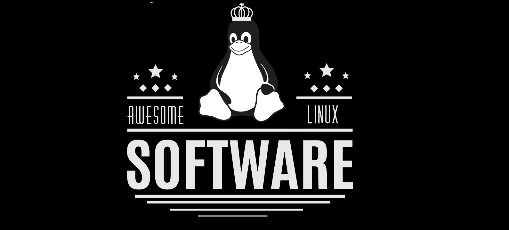

# Awesome-TheDump

🐧 This repo is a collection of **AWESOME** Linux applications and tools for **any users/developers**.
 
🐧 Feel free to **contribute** / **star** / **fork** / **pull request** . Any **recommendations** and **suggestions** are welcomed.

 ## [Games](#games)
- [Warzone 2100](https://www.wz2100.net/) - Open-source real-time strategy game that takes place after a nuclear war.
- [OpenRA](http://www.openra.net/) - Classic strategy games, rebuilt for the modern era. Open source.
- [Widelands](https://wl.widelands.org/) - Widelands is a open source RTS game with singleplayer campaigns and a multiplayer mode inspired by Settlers II.
- [0 AD](https://play0ad.com/) - Age of Empires like RTS game of ancient warfare.
- [TripleA](http://www.triplea-game.org/) - Open source grand strategy game with "Axis and Allies" game rules.
- [Unknown Horizons](http://unknown-horizons.org/) - A 2D realtime strategy simulation with an emphasis on economy and city building. Multiplayer currently broken.
- [OpenTTD](hptts://www.openttd.org) - An open-source clone of Transport Tycoon Plus with major improvements.

- [Minecraft](https://minecraft.net) - Minecraft is a game about placing blocks and going on adventures. Explore randomly generated worlds and build amazing things from the simplest of homes to the grandest of castles.
- [Minetest](https://minetest.net) - Open-source Minecraft written in C++ (uses less resources) and includes modding API. ![Open-Source Software][OSS Icon]

#### Gaming applications
- [Wine](https://www.winehq.org/) - Wine ("Wine Is Not an Emulator") is a compatibility layer capable of running Windows applications on Linux, quality depends from game to game ![Open-Source Software][OSS Icon]
- [PlayOnLinux](https://www.playonlinux.com) - A front-end for Wine. ![Open-Source Software][OSS Icon]
- [Steam](steampowered.com) - Gaming store, which opens the gates to many games.
- [RetroArch](http://www.retroarch.com/) - A front-end for a lot of game emulators. ![Open-Source Software][OSS Icon]
- [Lutris](https://lutris.net/) - Lutris is an open gaming platform for Linux. It helps you install and manage your games in a unified interface. ![Open-Source Software][OSS Icon](https://github.com/lutris/lutris)
